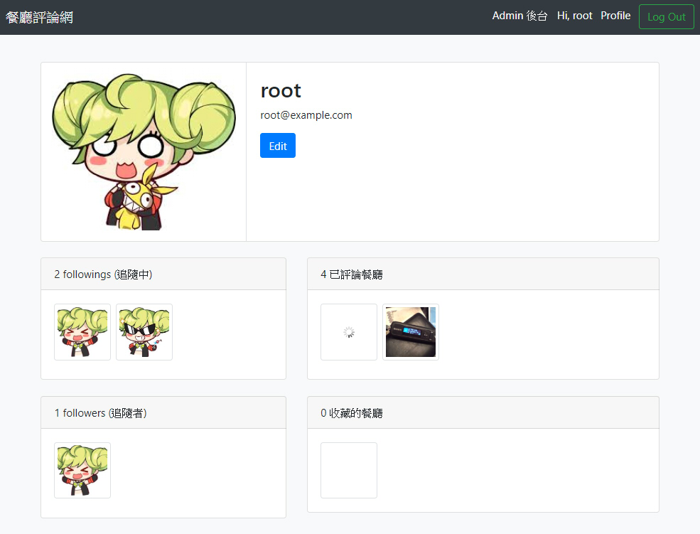

# Restaurant Forum
A restaurant forum demo app. <br>
This is a student project that built on Node.js with Express framework. <br>
Database used MySQL.

餐廳論壇 App。 <br>
Alpha Camp 學期四作業。 <br>

## Preview Pages


#### 功能
* 待補

## Usage
可於 [Heroku](https://lt-forum-demo.herokuapp.com/) 直接瀏覽，或下載後在本機執行專案。 <br>

安裝方法，請參考下方 [Dependency packages](#Dependency-packages) 與 [Installation](#Installation) 項目。 <br>
安裝完成後，使用以下步驟於本機端啟動專案。

1. 安裝 dependency npm pakages
    * 安裝專案套件，排除 nodemon
    ```
    $ npm install --only=prod
    ```
    * 一併安裝 nodemon 於專案中
    ```
    $ npm install
    ```
1. 於 cmd 啟動 MySQL。 
    * macOS
    ```
    1. 開啟「系統偏好設定介面」並點擊 MySQL 圖標
    2. 點擊 GUI 中的 Start MySQL Server
    ```
    
    * windows(需用系統管理員執行)
    ```
    $ net start mysql80
    ```
    
1. 使用 MySQL Workbench 工具，新建 database
    ```
    # SQL code
    CREATE DATABASE `your_database_name`;
    ```
    
1. 在 cmd 進入專案目錄，執行 migration 設定 database
    ```
    $ npx sequelize db:migrate
    ```

1. 執行 seeder，用於 MySQL 建立基本資料 (非必須)
    ```
    $ npx sequelize db:seed:all
    ```

    * 執行 seed 後可使用假帳戶進行快速測試
    ```
    // file path: /seeders/users.json
    
    email: "root@example.com",  // admin
    password: "12345678"
    
    email: "user1@example.com",
    password: "12345678"
    
    email: "user2@example.com",
    password: "12345678"
    ```
    
    * 如有需要，可 undo seeder 快速清空資料庫
    ```
    $ npx sequelize db:seed:undo:all
    ```

1. 於專案根目錄中新建 .env 檔案，設置環境變數。
    ```    
    // MySQL Server 帳戶資料
    MYSQL_USER = *** (your_user_name)
	MYSQL_KEY = *** (your_password)
	MYSQL_DATABASE = *** (your_database_name)
	MYSQL_HOST = 127.0.0.1
    
    // IMGUR 開發者API
    IMGUR_CLIENT_ID = *** (your_client_ID)
    ```

1. 啟動 Node.js Server
    
    * 有安裝 nodemon，於專案根目錄執行
    ```
    $ npm run dev
    ```

    * 未安裝 nodemon，於專案根目錄執行
    ```
    $ npm start
    ```

1. 於瀏覽器開啟網頁
    ```
    http://localhost:3000
    ```

1. 瀏覽完畢後，關閉 Node.js Server
    ```
    回到 cmd 按下 Ctrl + C
    ```

1. 關閉 MySQL
    * macOS
    ```
    1. 開啟「系統偏好設定介面」並點擊 MySQL 圖標
    2. 點擊 GUI 中的 Stop MySQL Server
    ```
    
    * windows(需用系統管理員執行)
    ```
    $ net stop mysql80
    ```

## Dependency packages
#### main
* [Node.js](https://nodejs.org/en/) v10.16.3
* [MySQL](https://www.mongodb.com/) v8.0.17

#### npm package
[link to check package.json](./package.json)

#### front-end package (imported from CDN)
* [Bootstrap](https://getbootstrap.com/) v4.3.1
  * jQuery v3.4.1
  * popper v1.14.7


## Installation
於本機端執行前，請確認是否已安裝下列內容。

#### Download Project
1. 直接於 Github 上用瀏覽器下載 ZIP file
2. 用 Git clone 專案 (推薦)
```
$ git clone https://github.com/Lastor-Chen/forum-demo.git [資料夾名稱]
```

#### Install Node.js
本機端必須安裝 Node.js 與相關 package 才能執行此專案。 <br>
如尚未安裝 Node.js，建議使用 nvm toolkit 下載指定版本的 Node.js

| OS | URL |
| -------- | -------- |
| nvm-windows     | [Link to](https://github.com/coreybutler/nvm-windows) |
| nvm-macOS     | [Link to](https://github.com/nvm-sh/nvm) |

#### Install dependency npm packages
已在 package.json 中登入相關訊息，可直接執行下列指令安裝所需套件。
```
$ npm install
```

#### Download MySQL
本機端必須安裝 MySQL 才能執行此專案。 <br>
請連結到 MySQL 官方網站[下載](https://dev.mysql.com/downloads/mysql/)。

#### 選擇安裝 nodemon
本專案推薦使用 [nodemon](https://github.com/remy/nodemon) 來取代原生的 Node.js 啟動方法。
```
$ npm install -g nodemon
```